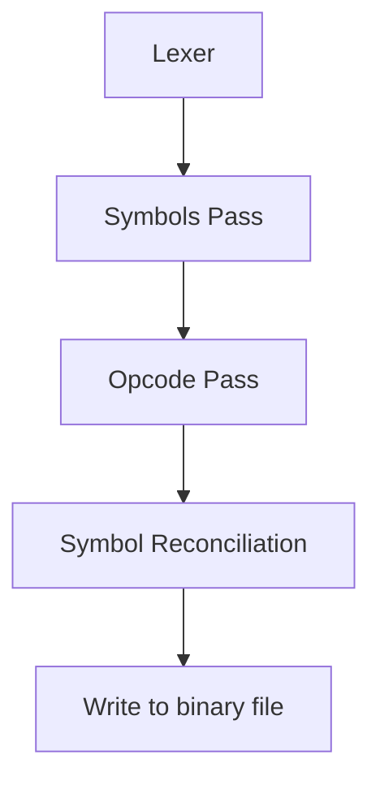

For referring back to online resources  [[Useful Online Links]]

During chats to ChatGPT I collated some initial notes collated here: [[Pathway to Assembler & Emulator]]

Tasks are tracked over at [[Task List]]

Flow of assembler 

